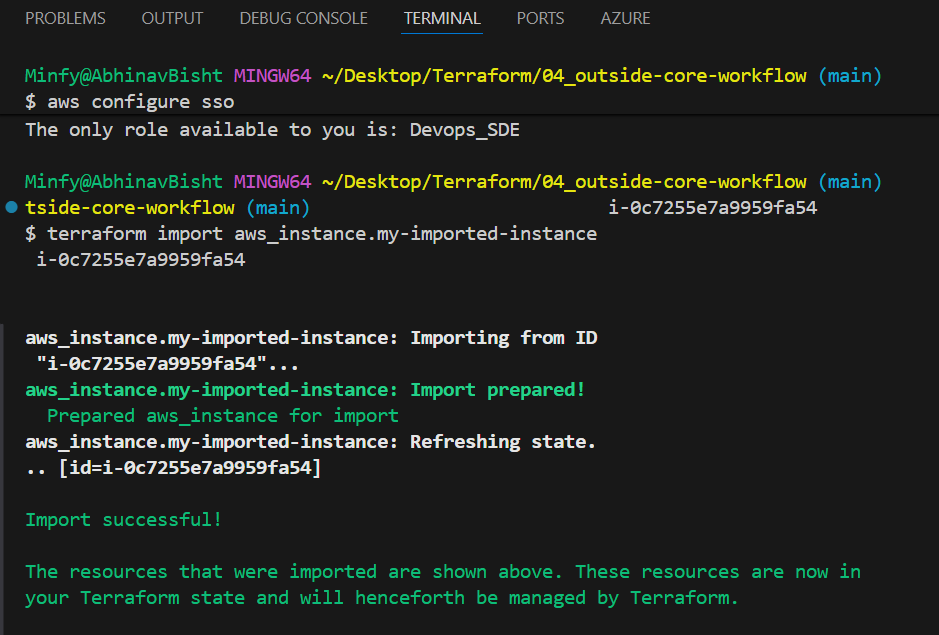
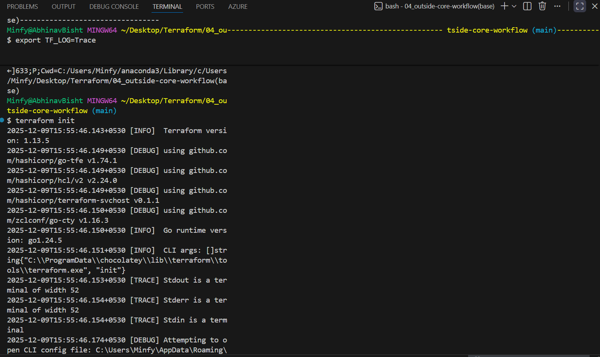

terraform fmt - to format

terraform state list - all resource references in the state file, terrafrom state show for more details

/*
depricated=>

using taints:
if you taint a resource you mark it to be recreated in the next execution, in cli: terrafrom taint aws_instance.web_server to recreate an instance.

if in any case the provisioner fails, the resouce/instance is tainted automatically(to recreate it)

can untaint too: terraform untaint aws_instance.web_server
*/

now we use, terraform apply -replace="aws_instance.web_server"

what if you have pre existing resources?
create a resouce of that type and import it to it: terraform import aws_instance.my-imported-instance i-0c7255e7a9959fa54, terrafrom import (resource) (resource id-resource specific)

but planning would give error, would have missing attributes, whatever is missing add those attributes to the config and then it should work

# terraform workspaces(DRY programming)

terraform state belongs to a workspace, infra created in 1 workspace doen't reflect as existing in another
terraform workspace + show/list/delete/new/select
terraform.workspace provides the curret workspace in code

# terraform state
terraform.tfstate, in json(creates backups)
terraform show, for entire state
terraform state show aws_instance.web-server, that specific resource state
terraform state rm aws_instance.web-server, remove that resource from the state file

# debugging
linux=> export TF_LOG=TRACE
PowerShell=> $env:TF_LOG="TRACE"
ca use: trace(most robust), debug, warn, info 
then terraform apply!!

to get all this in a log file use: export TF_LOG_PATH="terraform_log.txt"

pass "" in to turn off!

