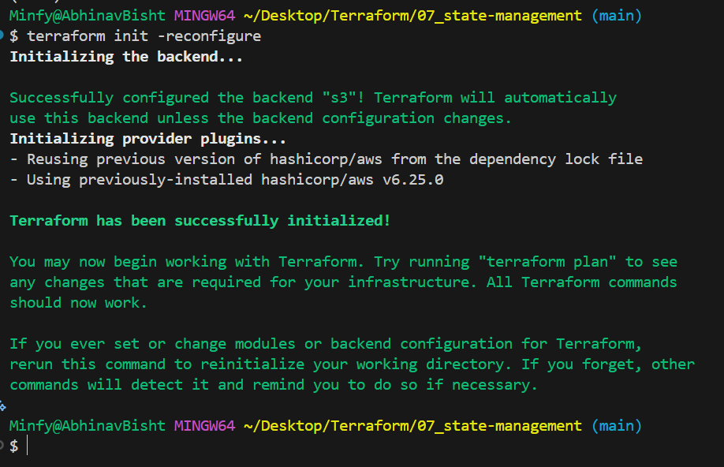
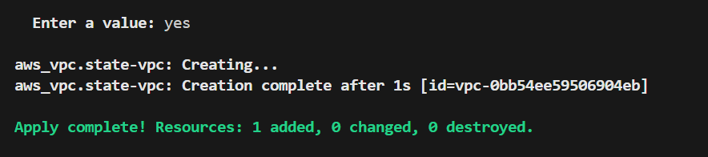
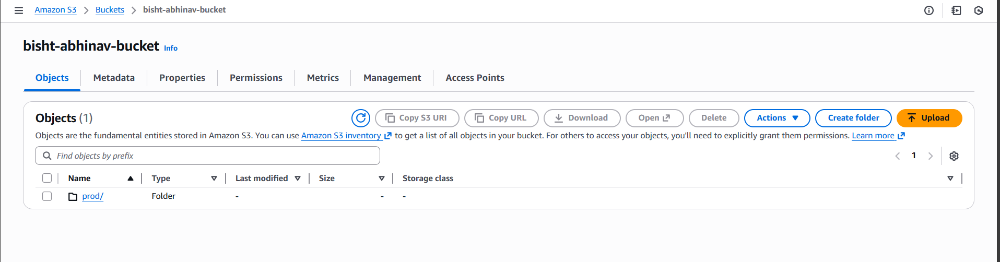
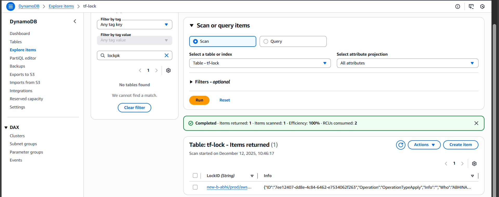
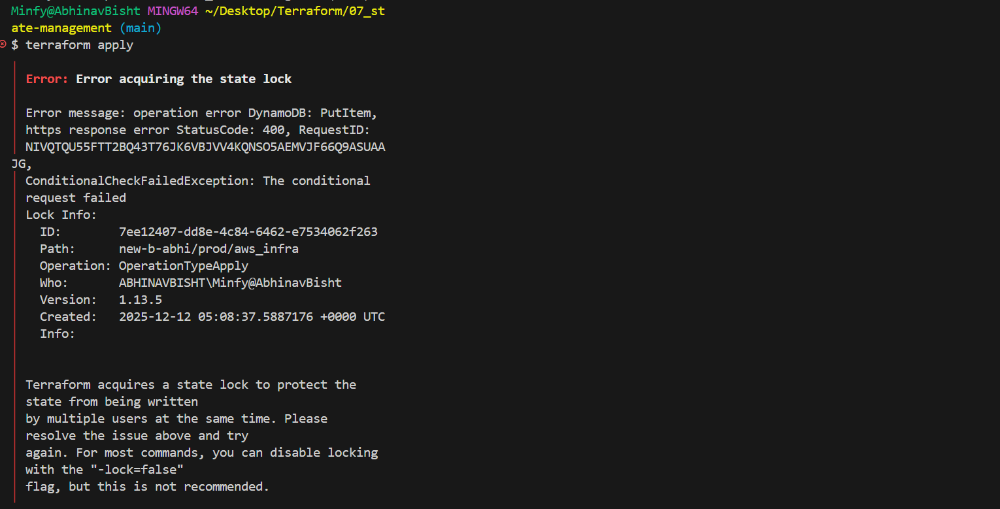
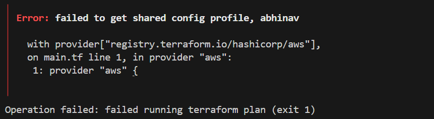
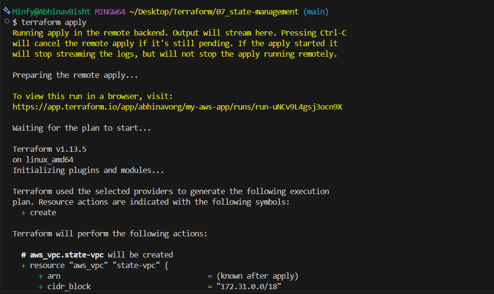
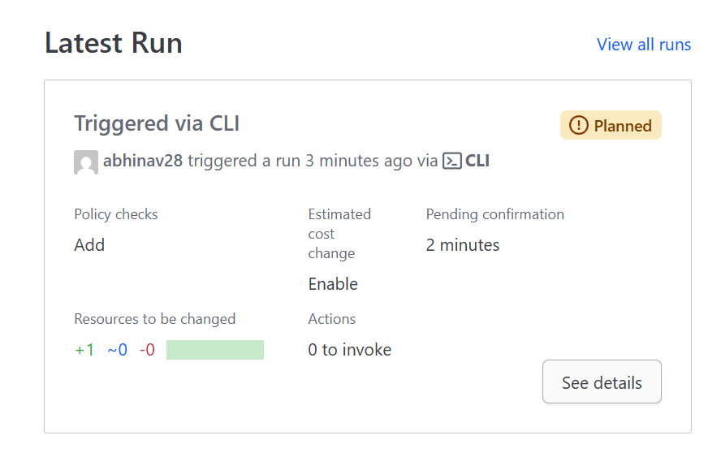
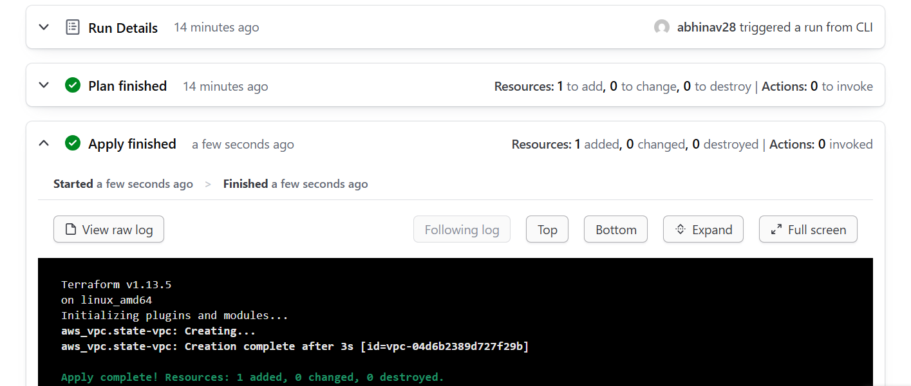
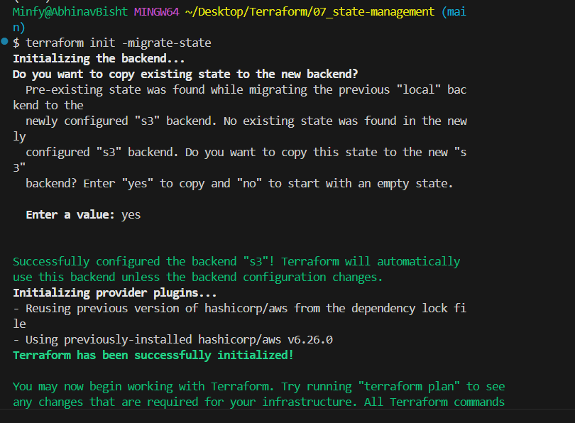

state is stored in local backend by default, terrafrom.tfstate(json)

maintain integrety of state file: state-locking, prevents concurrent modifications(if try modifying using 2 terminals, doen't permit apply on both, even shows who has the lock)

if the 2nd person: terraform apply -lock-timeout=60s, would wait for 60 sec for the lock to be freed.

not all backends support locking, eg s3 doesn't support directly but does support in coonjuction with dynamo db, azurerm supports it.

**state backend**

use terraform init -reconfigure before changing backends

- s3-standard: block all public access, give access and secret key as env vars

backend created remotely:

**locking backend**

locking it using dynamodb(if 1 is accessing 2 cant):

single backend per working directory

- terrafom remote enhanced backend: terraform cloud account -> create org -> terraform login in cli -> generate token+paste

Though standard backends store the state remotely but the terraform executions take place locally. Unlike them enhanced backends can store state and perform operations remotely

initially would throw an error as you are trying to create credentials on the tf cloud but it doesn't have your credentials, provide them using the variables section/environment variables in the tf cloud:

while using sso login, you also must give session token as a variable:

stores state file, can enable locking

**state migration**

create the new backend config, in the terraform block and use => terraform init -migrate-state

**more on state**

terraform refresh, reads the curr setting for managed obj and reflects the changes made to them without using terraform in the state file. Causes configuration drift thus has been depricated

modern => terraform plan -refresh-only
checks if remote resources match the config of the most rescent apply, but doesnt take any action. follow with, terraform apply -refresh-only

can create partial terraform configurations allow you to put the content of the backend "s3" block in the dev-s3-state.hcl file, then use terraform init -backend-config="path" -migrate-stare(if migrating), if any required item is not specified in the file terraform will prompt you for it. Using this you can have diff backend buckets/stores/files for diff environments too, you just need to change the path. 

# handling sensitive data in terraform state

some backend provide encryption eg s3, control access to state file and treat it as sensitive data