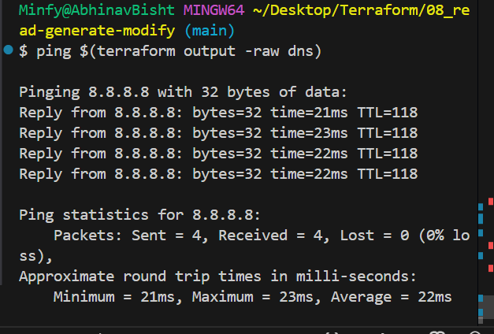
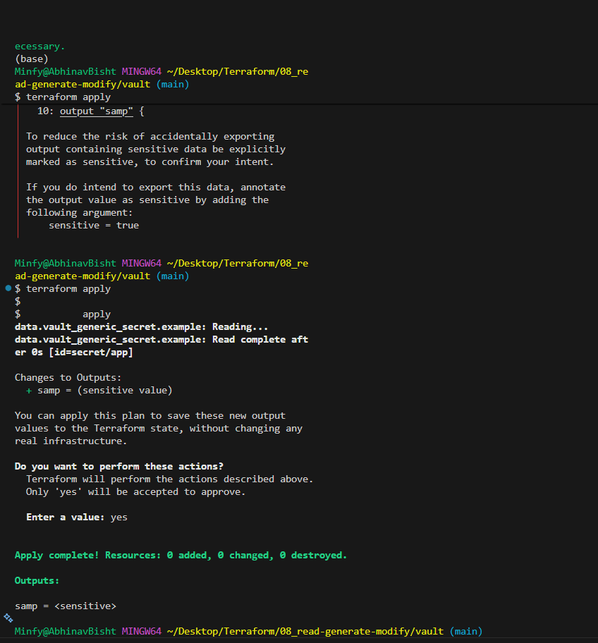
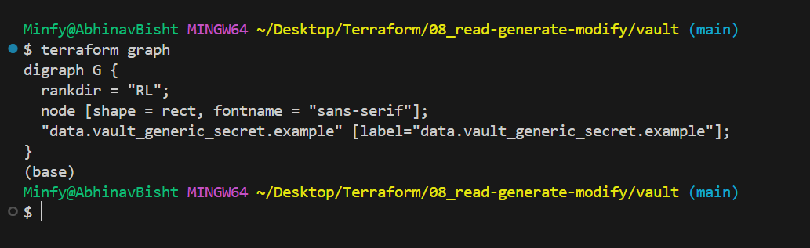
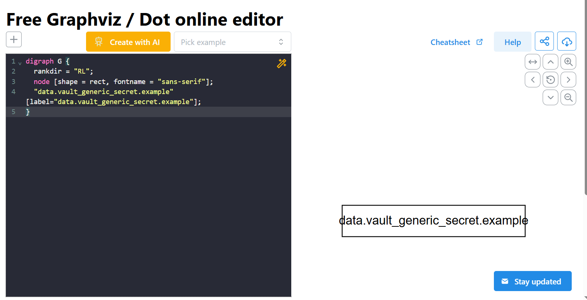

## locals

## variables
precedence: command line > .auto.tfvars > terraform.tfvars > env-vars > variables-default

can add validation to variables: cantains, case, regex etc

data types: string, number, bool, list(collection of similar types of values)/tuple(can contain dissimilar types), map(key value pairs)

can nest maps to easy iterate over a single var

for-each = var.v1 (runs all below it per content of v1)(only supported in resource block), create multiple resources
ip=each.value(iterator)

## outputs
- displaying 
- op from 1 modlue acts as input for another
- ip for cli commands, ping $(terraform output -raw dns)

sensitive=true to prevent displaying only from cli

## storing secrets

- sensitive=true(not outputting to cli)
- using env vars= export generally, using ui on tf cloud
- store data in hashicorp vault and pull to tf when req, demonstarted in the vault folder
  

export diff VAULT_ADDR as by default https, make http if doing in local

## data block
you can refer the documentation to see what resources when accessed using data block can provide what information
dont need to worry/check if you created that resource using terraform config

## built in functions(e.g.)
numeric(max, min), string(upper, lower), collection, encoding, file systems, hashing functions, ip-network(cidrsubnet(cidr, new bits, netnum))

## dynamic block
say you need multiple ingress

dynamic "ingress"{
    for_each=local.ingress-rule
    content{
        desc=ingress.value.desc
        from=ingress.value.port
        fromport=...
        toport=...
        protocol=...
        cidr=...
    }
}

ofc with nested map in local

## resource graph
a directed acyclic graph that Terraform constructs to represent the dependencies and creation order of resources defined in your configuration.

terraform graph => visual representation of either a configuration or executoin plan

can visualize this graph using tools like webgraphviz, a very basic eg:

## resource lifecycle
generally creation/destruction if order correct(follows resource graph), but if we need we can change this order using the lifecycle block. This is helped by directives like:

- create_before_destroy(generally the opposite is carried out): needed like in the cases of security groups which cant be destroyed first as they are attatched to instances(would timeout: 15 min).

in resource block:

lifecycle{
    create_before_destroy=true
}

- prevent_destroy: fails terraform destroy, for stakeful resources