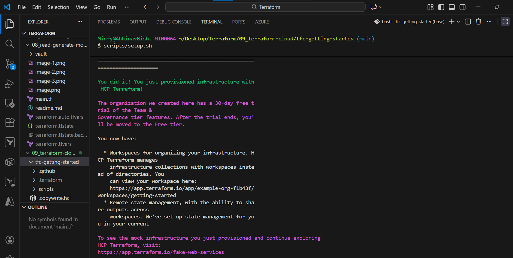
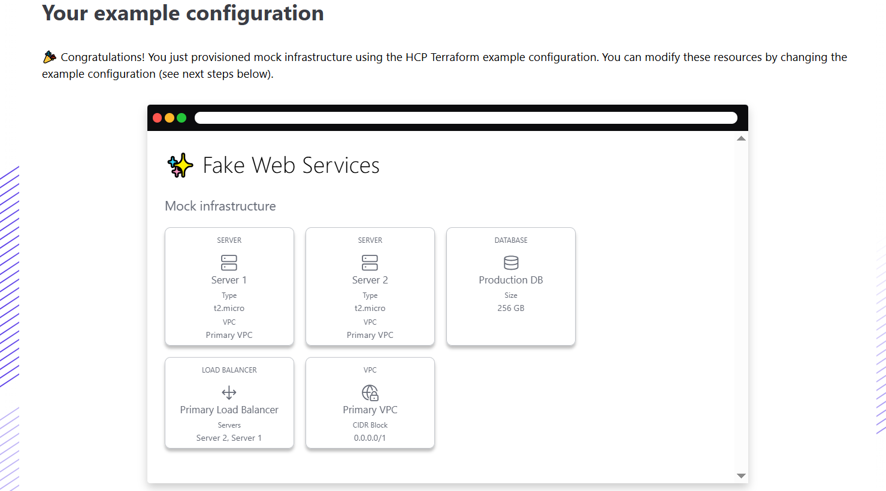
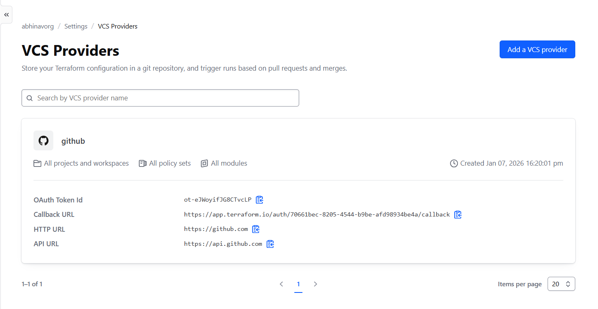
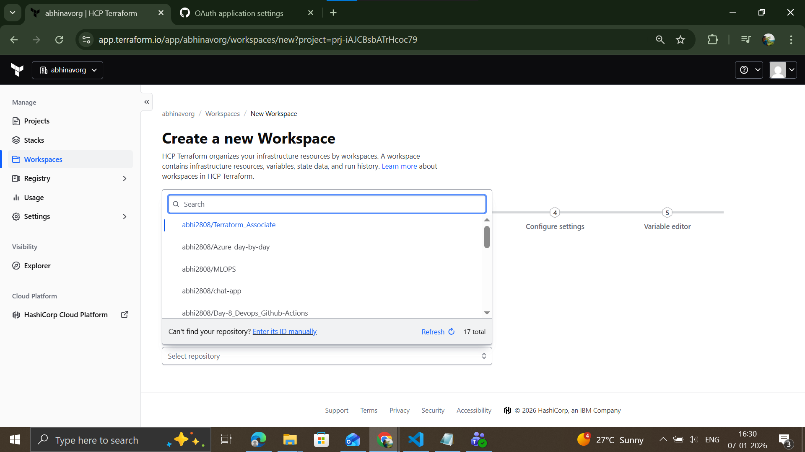

## steup

create account -> terraform login -> create and paste token

fake web services created:

provide the ability for terraform remote enhanced backend

for the terraform cloud to create aws infra, use workplace variables -> environment variables and create the access secret and the session token(if using sso)

## terraform cloud workspaces
similar to the cli, maintain seperate workspaces but are very vast in functionality.

provides various info, runs resources used, tf versions etc

workspaces store logs,have access management(read, plan, write, full) can notify. can deide what workflow to use, vc, vli or api driven

can set variables per workspace which help to modify things like region, env etc. can be used by creating those variables in the variable block and then using them normally

create a file containing,

workspace {name="devops-aws-my-app"} 

in a file ande use the command, terraform init -backend-config={filename} -reconfigure, to create infra in that workspace

can create variable sets, with several variables which can be used in multiple selected workspaces.

## version control

can integrate with vcs like github, gitlab, big bucket, azure devops:

now while creating workspaces, you would be provided with all of the projects in your github account to work with!

using this we can publish modules directly from our version control and get the code snippet to use that modeule, done using the private module registry

also you can have multiple workspaces utilizing the different branches of the same repo, with minor(generall environment based) differences.

## sentinel policy
run(by injection) bw plan and apply stage of workflow, we can use these to set guardrails like instances must have a name tag and sholud belong to a few selected sizes.

to be specified iun policy sets, can be brought using the github connection(selecting repo + path)

the sentinel policies have 3 enforcement levels:
- advisory: can fail, give warning 
- soft mandatory: can fail if override is specified
- hard mandatory: must pass no matter